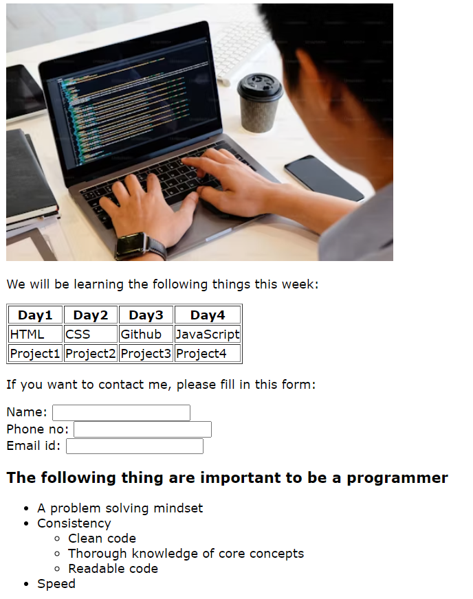
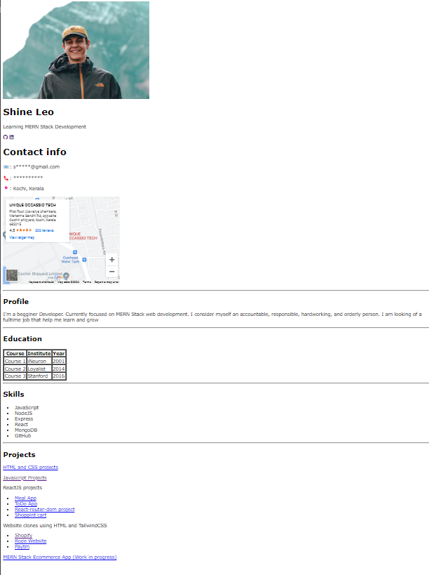

1.  what is HTML?
2. What is difference between HTML tags, elements and attributes?
3. What are different types of lists in HTML?
4. What is difference between “id attribute” and the “class attribute” of HTML elements?
5. List various types of formatting tags in HTML with example.
6. Explain the usage of `<!DOCTYPE>` in HTML.
7. What is the significance of the `<head>` and `<body>` tag?
8. State the difference between inline and block element.
9. What is the difference between `<link>` and `<a>` tag?
10. What is the difference between figure and figcaption tag
11. What is differences between the HTML vs HTML5.
12. What is forms in HTML?
13. Explain the types of inputs in HTML with example.
14. Explain the importance of meta tags and their types.
15. What are Sematic elements?
16. What is difference between `<meter>` tag and `<progress>` tag?
17. What is difference between SVG and Canvas HTML5 element?
18. Explain the concept of web storage in HTML5.
19. What is comment in HTML and its type and usage?
20. What are the empty elements?
21. What is the advantage of collapsing white space?
22. What is hyperlink? What is its need?
23. What is the need of alt tag in img tag?
24. What is difference between HTML and XHTML?
25. What is difference between absolute and relative URL?
26. What is the role of action attribute in HTML forms?
27. What is the role of method attribute in HTML forms?
28. What is grouping tag in HTML?
29. What is accessibility in HTML?

## Assignment 2

## Assignment 3

## Assignment 4

